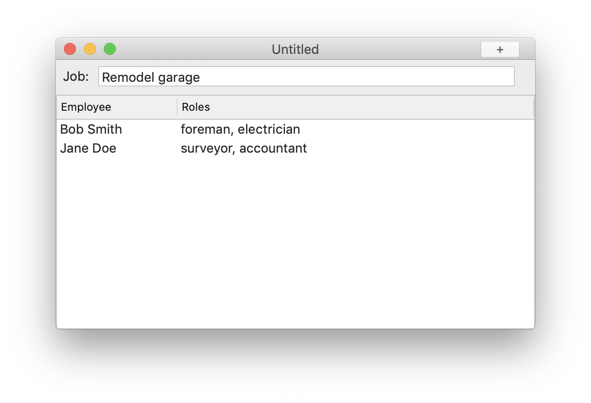

# reswift-example #

*README last updated Febuary 21st, 2020*

## Introduction

This repository contains my playground for learning the ins and outs of using [ReSwift](https://github.com/ReSwift/ReSwift). 

Right now there is one example application in this repository, `reswift-jobs`. There may be others down the road. We'll see.

### reswift-jobs 
`reswift-jobs` is a take-off of the [ReSwift example TODO app](https://github.com/ReSwift/ReSwift-Todo-Example) but instead of per-document TODO lists, it has per-document "Jobs" with lists of employees and their skills. 

This allows me to explore using a multicolumn NSOutlineView as well as moving employees between jobs and re-ordering them within a given job. In short, a number of new ReSwift actions on top of what the TODO example app does.

I chose this set of actions as a warm-up exercise for another app I'm working on, but chose employees and jobs as a nice break from the usual proverbial TODO list app. Besides, I wanted to literally type the code out from the TODO example app, not just copy the code whole cloth (though there definitely has been some of that done too.) This allows me to develop my "muscle memory" for working in ReSwift, which it, and the [Flux design pattern](https://www.freecodecamp.org/news/an-introduction-to-the-flux-architectural-pattern-674ea74775c9/) its based on is a new paradigm for me to wrap my wits about.

### Current state of reswift-jobs

I'm just getting underway on the project, here's the laundry list of things I want to accomplish.

```
[x] Started a public github repo
[x] Able to display, edit, undo/redo a job name
[x] Able to display employees assigned to a job
[ ] Able to edit, undo/redo employee names and skills
[ ] Able to re-order the list of employees with undo/redo
[ ] Able to add an employee with undo/redo
[ ] Able to delete an employee with undo/redo
[ ] Able to duplicate an employee with undo/redo
[ ] Able to move an employee from one job to another witn undo/redo
[ ] Job document load and save
```

### Things I'm considering changing ###

I jotted down these notes when I studied the source code for `ReSwift-TODO-Example`:

* UndoActionContext:
// TODO: I'm not too keen about having specific data model objects being
// referenced from this seemingly generic "UndoActionContext" module.
// Perhaps it's just a matter of giving this module a data model specific name.

* UndoMiddleware is also too generically named. 

* RemoveIdempotentActionsMiddleware is also generically named, but should not exist at all. Author's comment: "I'd suggest you stop firing events when the view knows nothing has changed." -- LET US TRY REMOVING THIS MODULE IN MY EXAMPLE REPO.
